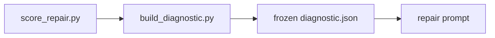

# Diagnostic generation

Deterministic projection from a **score report** ([`scoring_interface.md`](scoring_interface.md)) to a **diagnostic artefact** ([`diagnostic_model.md`](diagnostic_model.md) v2.0.0). Implemented by [`scripts/build_diagnostic.py`](../scripts/build_diagnostic.py).

## Deterministic projection

Projection is a **pure function** of `(score_report, level, case_id, run_id, iteration_index)`:

| Guarantee | Mechanism |
|-----------|-----------|
| No LLM / no repair generation | Script only reads and writes JSON |
| Score report unchanged | Input dict is never mutated |
| BPR recomputed | `passed_tests / total_tests` (1.0 when `total_tests == 0`) |
| Stable identity | `diagnostic_id = {case_id}__{run_id}__iter{NN}__{level}` |
| Audit trail | SHA-256 of score report file; optional hashes for FSM and oracle suite files |
| Schema enforcement | Output validated with `jsonschema` (required dependency) |

`generated_at` is the only field that varies with wall clock when not fixed by the caller (CLI uses current UTC).

## Score report → diagnostic mapping

| Score report | Diagnostic |
|--------------|------------|
| `suite_id` or `oracle_suite_path` (stem) | `scoring_summary.oracle_suite_id` |
| `total_tests` | `scoring_summary.total_checks` |
| `passed_tests` | `scoring_summary.passed_checks` |
| `failed_tests` | `scoring_summary.failed_checks` |
| (recomputed) | `scoring_summary.bpr` |
| `failures[]` | `failed_checks[]` (`test_id` → `check_id`) |
| `failures[].trace` | `failed_checks[].input_trace` (trace / localized) |
| `failures[].expected` / `observed` | same (trace / localized) |
| `failures[].diagnostic_hint` | `failed_checks[].diagnostic_hint` (binary may include; trace / localized) |
| `localization` (optional) | `localization` (localized only) |
| `fsm_path`, `oracle_suite_path` | `reproducibility` paths |
| `score_schema_version` | `reproducibility.scorer_version` |
| Score report file bytes | `reproducibility.checksums.score_report_sha256` |

### Failure category counts (from `failures[].failure_type`)

| Counter | Increment when |
|---------|----------------|
| `final_state_failures` | `final_state_mismatch` |
| `trace_failures` | `trace_mismatch` |
| `rejection_failures` | `unexpected_acceptance`, `unexpected_rejection`, or `unexpected_transition` |
| `simulation_failures` | `simulation_error` |
| `nondeterminism_failures` | `nondeterminism` or `nondeterminism_conflict` |
| `positive_path_failures` | `trace_mismatch`, `final_state_mismatch`, or `undefined_transition` |

## Level-specific information filtering

| Field / section | `binary` (C) | `trace` (D) | `localized` (E) |
|-----------------|--------------|-------------|-------------------|
| `scoring_summary` | ✓ | ✓ | ✓ |
| `failure_categories` | ✓ | ✓ | ✓ |
| `failed_checks`: ids + types | ✓ | ✓ | ✓ |
| `failed_checks`: `diagnostic_hint` | ✓ (if present) | ✓ | ✓ |
| `failed_checks`: traces / expected / observed / final states | ✗ | ✓ | ✓ |
| `localization` | ✗ | ✗ | ✓ (empty arrays if absent in report) |

Filtering is implemented in `build_diagnostic.py` and enforced again by [`schemas/diagnostic.schema.json`](../schemas/diagnostic.schema.json).

## Preventing diagnostic leakage

Experimental conditions C–E must not share the same feedback channel:

| Risk | Mitigation |
|------|------------|
| Condition C receives trace witnesses | `binary` projection strips trace and observation fields |
| Condition D receives localization | `trace` projection forbids `localization` |
| Validation oracle results in repair prompts | Project only **feedback** score reports; keep validation BPR on the repair run |
| Repair reads full score report | Freeze **diagnostic JSON**; prompts reference that path only |

See **Threat to validity: diagnostic leakage** in [`diagnostic_model.md`](diagnostic_model.md).

## CLI

```bash
python scripts/score_repair.py \
  --fsm candidates/iter_000.json \
  --oracles datasets/oracle_suites/feedback_v1.json \
  --output scores/iter_000_score.json

python scripts/build_diagnostic.py \
  --score-report scores/iter_000_score.json \
  --level trace \
  --case-id tlc_01 \
  --run-id tlc_01__patch_trace_feedback__r001 \
  --iteration-index 0 \
  --output feedback/iter_000.json
```

| Argument | Description |
|----------|-------------|
| `--score-report` | Input score report (read-only) |
| `--level` | `binary`, `trace`, or `localized` |
| `--case-id`, `--run-id`, `--iteration-index` | Identity for `diagnostic_id` and `identity` block |
| `--output` | Output diagnostic JSON |

Exit code `0` on success, `2` on error. Missing `jsonschema` fails with an install hint.

## Use in repair prompts (planned)



1. Score candidate on **feedback** oracles after each iteration.
2. Run `build_diagnostic.py` with `--level` matching the repair condition (`patch_binary_feedback` → `binary`, etc.).
3. Store the output path as `feedback_summary_path` on the repair run ([`repair_run_format.md`](repair_run_format.md)).
4. Prompt templates under [`prompts/`](../prompts/) will summarize **only** the diagnostic artefact—never the raw score report or validation suite.

`repair_hints` are not produced by this script.

## See also

- [`diagnostic_model.md`](diagnostic_model.md) — artefact definition
- [`experimental_conditions.md`](experimental_conditions.md) — conditions C–E
- [`scripts/README.md`](../scripts/README.md) — script index
