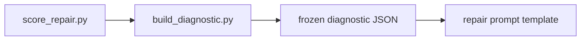

# Diagnostic generation

Deterministic projection from a **score report** ([`scoring_interface.md`](scoring_interface.md)) to a **diagnostic artefact** ([`diagnostic_model.md`](diagnostic_model.md)). Implemented by [`scripts/build_diagnostic.py`](../scripts/build_diagnostic.py).

## Why projection is deterministic

| Property | Mechanism |
|----------|-----------|
| Same score report + same level → same diagnostic | Pure field filtering and renaming; no randomness, clocks in tests, or network |
| BPR recomputed | `passed_tests / total_tests` (vacuous pass when `total_tests == 0`) |
| Checksums | SHA-256 of the FSM and oracle suite files referenced in the score report |
| No LLM | Script only reads JSON and writes JSON |

The scorer ([`score_repair.py`](../scripts/score_repair.py)) and projector are separate stages: **evaluation** produces the score report; **projection** shapes what repair may see.

## Preventing leakage between conditions

Experimental conditions C, D, and E differ only in **how much** of the score report is copied into the diagnostic channel:

| Level | Condition | Withheld from repair channel |
|-------|-----------|------------------------------|
| `binary` | `patch_binary_feedback` | Traces, expected/observed witnesses, localization |
| `trace` | `patch_trace_feedback` | Localization |
| `localized` | `patch_localized_feedback` | Nothing beyond optional `repair_hints` |

Projection is enforced in code (`build_diagnostic`) and in schema (`diagnostic.schema.json`). Repair procedures must consume the **frozen diagnostic JSON**, not the full score report, so condition C cannot accidentally receive trace witnesses.

**Validation oracles:** score reports used for confirmatory BPR on repair runs may come from a different suite id; only feedback-suite reports should be projected into repair-channel diagnostics. See **Threat to validity: diagnostic leakage** in [`diagnostic_model.md`](diagnostic_model.md).

## Score report → diagnostic mapping

| Score report field | Diagnostic field |
|--------------------|------------------|
| `suite_id` | `scoring_summary.oracle_suite_id` |
| `total_tests` | `scoring_summary.total_checks` |
| `passed_tests` | `scoring_summary.passed_checks` |
| `failed_tests` | `scoring_summary.failed_checks` |
| (recomputed) | `scoring_summary.bpr` |
| `failures[]` | `failed_checks[]` (`test_id` → `check_id`) |
| `failures[].trace` | `failed_checks[].input_trace` (trace/localized only) |
| `failures[].expected` / `observed` | same (trace/localized only) |
| `localization` (optional) | `localization` (localized only; empty arrays if absent) |
| `fsm_path`, `oracle_suite_path` | `reproducibility` paths + checksums |
| `score_schema_version` | `reproducibility.scorer_version` |

Oracle types for failed checks are resolved from the oracle suite file when `oracle_suite_path` is readable; otherwise inferred from `failure_type`.

## CLI

```bash
python scripts/score_repair.py \
  --fsm candidates/iter_000.json \
  --oracles datasets/oracle_suites/feedback_v1.json \
  --output scores/iter_000_score.json

python scripts/build_diagnostic.py \
  --score-report scores/iter_000_score.json \
  --level trace \
  --case-id tlc_01 \
  --run-id tlc_01__patch_trace_feedback__r001 \
  --iteration-index 0 \
  --output feedback/iter_000.json
```

| Argument | Description |
|----------|-------------|
| `--score-report` | Input score report (not modified) |
| `--level` | `binary`, `trace`, or `localized` |
| `--case-id` | Repair case id |
| `--run-id` | Repair run id |
| `--iteration-index` | Zero-based iteration |
| `--output` | Output diagnostic JSON path |
| `--no-schema-check` | Skip jsonschema validation (not recommended) |

Exit code `0` on success, `2` on build/validation error.

## Use in the repair pipeline (planned)



1. After each repair iteration, score the candidate on **feedback** oracles → score report.
2. Project with `--level` matching `repair_condition` (C→`binary`, D→`trace`, E→`localized`).
3. Store path on the repair run as `feedback_summary_path` ([`repair_run_format.md`](repair_run_format.md)).
4. Prompt templates ([`prompts/`](../prompts/)) will embed or summarize **only** the diagnostic file—never the full score report or validation suite.

`repair_hints` are not generated by this script; optional rule-based hints remain a separate, explicit step.

## Optional localization in score reports

`build_diagnostic` does not compute localization. If a future scorer or preprocessor attaches a `localization` object to the score report, localized projection copies it; otherwise it emits empty arrays so the schema remains valid.

## See also

- [`diagnostic_model.md`](diagnostic_model.md) — artefact definition and examples
- [`experimental_conditions.md`](experimental_conditions.md) — conditions C–E
- [`scripts/README.md`](../scripts/README.md) — script index
