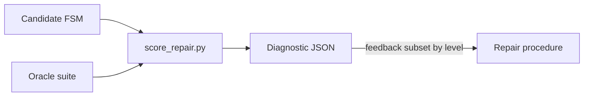

# Diagnostic model for oracle-guided repair

A **diagnostic** is the formal artefact that **separates evaluation from repair**. It is produced deterministically when an FSM candidate is scored against an oracle suite ([`scoring_interface.md`](scoring_interface.md)). It carries no generative-engine fields, no prompt text, and no patch proposals unless explicitly added under optional `repair_hints` (heuristic, still non-LLM).

Machine validation: [`schemas/diagnostic.schema.json`](../schemas/diagnostic.schema.json).

## Scientific role



| Stage | Artefact | Engine involved? |
|-------|----------|------------------|
| **Evaluation** | Score report + diagnostic | No |
| **Repair** | Patches / FSM edits | Yes (out of band for this schema) |

The diagnostic is the **controlled information channel** manipulated across experimental conditions ([`experimental_conditions.md`](experimental_conditions.md)). The same underlying evaluation can be **projected** to different diagnostic levels before repair sees it.

## Diagnostic levels

| Level | Name | Experimental condition | What repair may see |
|-------|------|----------------------|---------------------|
| **1** | Binary feedback | `patch_binary_feedback` (C) | Pass/fail per failed test id; no traces or localization |
| **2** | Trace feedback | `patch_trace_feedback` (D) | Level 1 + execution traces (events, state sequences) |
| **3** | Localized feedback | `patch_localized_feedback` (E) | Level 2 + `localization` (suspicious states/transitions, structural candidates) |

**Not diagnostic levels:** `baseline_no_repair` (A) produces evaluation only—no repair feedback channel. `baseline_full_regeneration` (B) does not consume iteration diagnostics.

### Projection rule

1. Run deterministic scoring → full score report (all failure detail).
2. **Project** to `diagnostic_level` by filtering fields (documented per level below).
3. Freeze projected JSON as `feedback_summary_path` on the repair run ([`repair_run_format.md`](repair_run_format.md)).

Projection is a pure function: same score report + same level → same diagnostic.

## Record structure

```
diagnostic
├── schema_version
├── diagnostic_level          (1 | 2 | 3)
├── identity                  diagnostic_id, case_id, run_id, iteration_index
├── scoring_summary           total_tests, passed_tests, failed_tests, bpr
├── failure_summary           aggregates by category
├── failed_tests[]            per-failure witnesses (filtered by level)
├── localization              (level 3 required; optional below)
├── repair_hints              (optional; heuristic only)
└── provenance                (optional paths, timestamps)
```

## Section specifications

### Identity

Links one evaluation to the experimental graph.

| Field | Role |
|-------|------|
| `diagnostic_id` | Unique artefact slug (e.g. `tlc_01__run001__iter00__diag`) |
| `case_id` | Repair case ([`experimental_unit.md`](experimental_unit.md)) |
| `run_id` | Repair run ([`repair_run_format.md`](repair_run_format.md)) |
| `iteration_index` | Zero-based iteration |

### Scoring summary

Mirrors [`scoring_interface.md`](scoring_interface.md) headline metrics on the oracle suite used for this projection (typically **feedback** oracles for repair; **validation** oracles may be scored separately for BPR claims).

| Field | Definition |
|-------|------------|
| `total_tests` | Count of tests in suite |
| `passed_tests` | Passed count |
| `failed_tests` | Failed count |
| `bpr` | `passed_tests / total_tests` |

### Failure summary

| Field | Definition |
|-------|------------|
| `failure_count` | Same as `failed_tests` in scoring_summary |
| `failure_categories` | Distinct `failure_type` values across failed tests |
| `positive_path_failures` | Failures with `oracle_type` ∈ {`trace`, `final_state`} |
| `rejection_failures` | Failures with `oracle_type` == `rejected_event` |

### Failed tests

One object per failing test after projection.

| Field | Level 1 | Level 2 | Level 3 |
|-------|---------|---------|---------|
| `test_id` | ✓ | ✓ | ✓ |
| `oracle_type` | ✓ | ✓ | ✓ |
| `failure_type` | ✓ | ✓ | ✓ |
| `expected_result` | minimal | full | full |
| `observed_result` | minimal | full | full |
| `expected_final_state` | if applicable | ✓ | ✓ |
| `observed_final_state` | if applicable | ✓ | ✓ |
| `trace` | **null** | ✓ | ✓ |

**Level 1 minimal witnesses:** `expected_result` / `observed_result` may be empty objects `{}` or carry only `{"passed": false}`.

### Localization (optional / level 3)

Aggregated hints derived from failures + case structural diagnostics ([`repair_case`](../schemas/repair_case.schema.json) `diagnostics`), not from an LLM.

| Field | Meaning |
|-------|---------|
| `suspicious_states` | States appearing in mismatching traces or final-state errors |
| `suspicious_transitions` | Transitions implicated in trace mismatch |
| `missing_transition_candidates` | Reference transitions absent in candidate |
| `extra_transition_candidates` | Candidate transitions spurious vs reference |

**Level 3:** `localization` is **required** and should be non-empty when `failure_count > 0`.

### Repair hints (optional)

Heuristic suggestions (rule-based alignment to [`patch_language.md`](patch_language.md)). Never required for a valid diagnostic. May be omitted entirely to avoid conflating evaluation with automated repair planning.

| Field | Meaning |
|-------|---------|
| `suggested_patch_operations` | Typed patch ops consistent with patch schema |
| `suggested_targets` | Short labels for focus regions |
| `confidence` | Heuristic certainty ∈ [0, 1] |

## Condition → level mapping

| Condition | `diagnostic_level` | Diagnostic emitted for repair? |
|-----------|-------------------|--------------------------------|
| `baseline_no_repair` | — | No (evaluation only) |
| `baseline_full_regeneration` | — | No |
| `patch_binary_feedback` | **1** | Yes |
| `patch_trace_feedback` | **2** | Yes |
| `patch_localized_feedback` | **3** | Yes |

Within conditions C–E, **validation** scoring may still use the full score report internally; only the **projected** diagnostic is exposed to the repair channel. Validation BPR on the run record remains authoritative for outcomes ([`repair_run_format.md`](repair_run_format.md)).

## Derivation from score report

| Score report field | Diagnostic field |
|------------------|------------------|
| `total_tests`, `passed_tests`, `failed_tests`, `bpr` | `scoring_summary.*` |
| `failures[]` | `failed_tests[]` (mapped + filtered) |
| `failures[].failure_type` | `failure_summary.failure_categories` |
| Count by `oracle_type` | `positive_path_failures`, `rejection_failures` |

Implementation of `project_diagnostic(score_report, level, identity, ...)` is deferred; the schema and projection rules are normative.

## Example — Level 1 (binary)

```json
{
  "schema_version": "1.0.0",
  "diagnostic_level": 1,
  "identity": {
    "diagnostic_id": "tlc_01__patch_binary__r001__iter00",
    "case_id": "tlc_01",
    "run_id": "tlc_01__patch_binary_feedback__r001",
    "iteration_index": 0
  },
  "scoring_summary": {
    "total_tests": 3,
    "passed_tests": 1,
    "failed_tests": 2,
    "bpr": 0.3333333333333333
  },
  "failure_summary": {
    "failure_count": 2,
    "failure_categories": ["trace_mismatch", "unexpected_transition"],
    "positive_path_failures": 1,
    "rejection_failures": 1
  },
  "failed_tests": [
    {
      "test_id": "trace_ab",
      "oracle_type": "trace",
      "failure_type": "trace_mismatch",
      "expected_result": {},
      "observed_result": {},
      "expected_final_state": null,
      "observed_final_state": null,
      "trace": null
    },
    {
      "test_id": "reject_unknown_z",
      "oracle_type": "rejected_event",
      "failure_type": "unexpected_transition",
      "expected_result": {},
      "observed_result": {},
      "expected_final_state": null,
      "observed_final_state": null,
      "trace": null
    }
  ],
  "provenance": {
    "score_report_path": "scores/iter_000_score.json",
    "oracle_suite_id": "tlc_feedback_v1",
    "candidate_fsm_path": "candidates/initial.json",
    "derived_at": "2026-06-03T14:01:00Z"
  }
}
```

## Example — Level 2 (trace)

```json
{
  "schema_version": "1.0.0",
  "diagnostic_level": 2,
  "identity": {
    "diagnostic_id": "tlc_01__patch_trace__r001__iter00",
    "case_id": "tlc_01",
    "run_id": "tlc_01__patch_trace_feedback__r001",
    "iteration_index": 0
  },
  "scoring_summary": {
    "total_tests": 3,
    "passed_tests": 1,
    "failed_tests": 2,
    "bpr": 0.3333333333333333
  },
  "failure_summary": {
    "failure_count": 2,
    "failure_categories": ["trace_mismatch", "unexpected_transition"],
    "positive_path_failures": 1,
    "rejection_failures": 1
  },
  "failed_tests": [
    {
      "test_id": "trace_ab",
      "oracle_type": "trace",
      "failure_type": "trace_mismatch",
      "expected_result": { "states": ["s0", "s1", "s0"] },
      "observed_result": { "states": ["s0", "s1", "s1"] },
      "expected_final_state": "s0",
      "observed_final_state": "s1",
      "trace": {
        "events": ["a", "b"],
        "states": ["s0", "s1", "s1"]
      }
    },
    {
      "test_id": "reject_unknown_z",
      "oracle_type": "rejected_event",
      "failure_type": "unexpected_transition",
      "expected_result": { "no_transition": true },
      "observed_result": { "to": "s1" },
      "expected_final_state": null,
      "observed_final_state": null,
      "trace": {
        "events": ["z"],
        "from_state": "s0"
      }
    }
  ]
}
```

## Example — Level 3 (localized)

```json
{
  "schema_version": "1.0.0",
  "diagnostic_level": 3,
  "identity": {
    "diagnostic_id": "tlc_01__patch_localized__r001__iter00",
    "case_id": "tlc_01",
    "run_id": "tlc_01__patch_localized_feedback__r001",
    "iteration_index": 0
  },
  "scoring_summary": {
    "total_tests": 3,
    "passed_tests": 1,
    "failed_tests": 2,
    "bpr": 0.3333333333333333
  },
  "failure_summary": {
    "failure_count": 2,
    "failure_categories": ["trace_mismatch", "unexpected_transition"],
    "positive_path_failures": 1,
    "rejection_failures": 1
  },
  "failed_tests": [
    {
      "test_id": "trace_ab",
      "oracle_type": "trace",
      "failure_type": "trace_mismatch",
      "expected_result": { "states": ["s0", "s1", "s0"] },
      "observed_result": { "states": ["s0", "s1", "s1"] },
      "expected_final_state": "s0",
      "observed_final_state": "s1",
      "trace": {
        "events": ["a", "b"],
        "states": ["s0", "s1", "s1"]
      }
    },
    {
      "test_id": "reject_unknown_z",
      "oracle_type": "rejected_event",
      "failure_type": "unexpected_transition",
      "expected_result": { "no_transition": true },
      "observed_result": { "to": "s1" },
      "expected_final_state": null,
      "observed_final_state": null,
      "trace": { "events": ["z"], "from_state": "s0" }
    }
  ],
  "localization": {
    "suspicious_states": ["s1"],
    "suspicious_transitions": [
      { "from": "s1", "event": "b", "to": "s1", "note": "Self-loop on b" }
    ],
    "missing_transition_candidates": [
      { "from": "s_green", "event": "tick", "to": "s_yellow" }
    ],
    "extra_transition_candidates": [
      { "from": "s0", "event": "z", "to": "s1" }
    ]
  },
  "repair_hints": {
    "suggested_patch_operations": [
      { "op": "update_transition", "from": "s1", "event": "b", "old_to": "s1", "new_to": "s0" }
    ],
    "suggested_targets": ["s1", "s_green→s_yellow"],
    "confidence": 0.7
  }
}
```

## Archival layout

```
results/frozen_runs/<case_id>/<condition>/<run_id>/
  diagnostics/
    iter_000_level1.json
    iter_000_level2.json   # optional audit copies
    iter_000_level3.json
  feedback/
    iter_000.json          # projected copy actually fed to repair (one level)
```

Only the feedback file matching the run’s condition level is consumed by repair; other levels may be stored for analysis transparency.

## Validity and threats

| Threat | Mitigation |
|--------|------------|
| Feedback/validation conflation | Separate oracle suite ids; document which suite was scored into each diagnostic |
| Overfitting to feedback | Compare validation BPR on run record vs feedback-only gains |
| Hint leakage into evaluation | `repair_hints` optional and non-normative |
| Level mismatch | `diagnostic_level` must match `repair_condition` |

## See also

- [`repairability_definition.md`](repairability_definition.md) — overfitting, regression
- [`scoring_interface.md`](scoring_interface.md) — upstream score report
- [`experimental_conditions.md`](experimental_conditions.md) — conditions C–E
