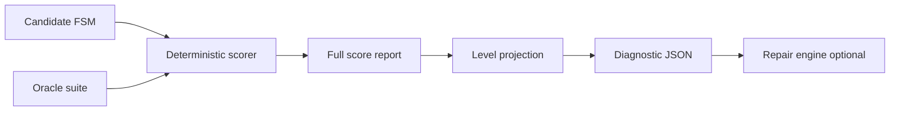

# Oracle diagnostic model

A **diagnostic** is the formal artefact produced after **deterministically** evaluating one FSM candidate against one oracle suite ([`scoring_interface.md`](scoring_interface.md)). It is the controlled boundary between **evaluation** (no generative model) and **repair** (may use a local LLM engine).

Machine validation: [`schemas/diagnostic.schema.json`](../schemas/diagnostic.schema.json) (v2.0.0).

## Independence from LLMs

Diagnostics are **not** prompts, completions, or model-internal states. They contain only:

- Outcomes of [`score_repair.py`](../scripts/score_repair.py) (pass/fail, witnesses, aggregates)
- Optional **rule-based** localization derived from failures and frozen case structure
- Optional **repair_hints** that reference the patch vocabulary ([`patch_language.md`](patch_language.md)) without invoking a model

| Property | Implication |
|----------|-------------|
| Same inputs → same diagnostic | Reproducible across replications and engines |
| No `model_id`, temperature, or tokens | Engine swaps do not change the diagnostic definition |
| `reproducibility` block | Pins FSM path, suite path, scorer version, checksums |

The LLM enters **only** when a repair condition consumes a **projected** diagnostic to propose patches. Conditions A–B never expose diagnostics to repair; C–E differ only in **how much** of the full score report is projected into the diagnostic channel.



## Diagnostic levels and experimental conditions

| `diagnostic_level` | Condition | `condition_id` |
|--------------------|-----------|----------------|
| `binary` | C | `patch_binary_feedback` |
| `trace` | D | `patch_trace_feedback` |
| `localized` | E | `patch_localized_feedback` |

Baselines **A** (`baseline_no_repair`) and **B** (`baseline_full_regeneration`) may still **generate** diagnostics for auditing, but those diagnostics are **not** fed into a patch feedback loop ([`experimental_conditions.md`](experimental_conditions.md)).

### Projection (normative)

1. Score candidate → full score report (all failure detail retained off-channel).
2. Project to `identity.diagnostic_level`.
3. Freeze as `feedback_summary_path` on the repair run ([`repair_run_format.md`](repair_run_format.md)).

## Record structure

```
diagnostic
├── identity                 diagnostic_id, schema_version, case_id, run_id,
│                            iteration_index, diagnostic_level
├── scoring_summary          oracle_suite_id, total_checks, passed_checks,
│                            failed_checks, bpr
├── failure_categories       per-type failure counts
├── failed_checks[]          per-failure witnesses (filtered by level)
├── localization             (localized only; forbidden for binary/trace)
├── repair_hints             (optional; typically localized only)
└── reproducibility          paths, scorer_version, generated_at, checksums
```

### Scoring summary

| Field | Definition |
|-------|------------|
| `oracle_suite_id` | Suite scored (typically **feedback** oracles for repair) |
| `total_checks` | Number of checks in suite |
| `passed_checks` | Passed count |
| `failed_checks` | Failed count |
| `bpr` | `passed_checks / total_checks` when `total_checks > 0`; else `1.0` |

**Invariant:** when `total_checks > 0`, `bpr` must equal `passed_checks / total_checks` (validated in tests).

### Failure categories

| Field | Counts failures where |
|-------|----------------------|
| `positive_path_failures` | `oracle_type` ∈ {`trace`, `final_state`} |
| `rejection_failures` | `oracle_type` == `rejected_event` |
| `final_state_failures` | `failure_type` == `final_state_mismatch` |
| `trace_failures` | `failure_type` == `trace_mismatch` |
| `nondeterminism_failures` | `failure_type` == `nondeterminism_conflict` |
| `simulation_failures` | `failure_type` ∈ {`simulation_error`, `fsm_integrity_error`, `undefined_transition`} |

### Failed checks

Each entry describes one failing check. Fields beyond `check_id`, `oracle_type`, and `failure_type` are **withheld** at lower levels (see leakage section).

| Field | `binary` | `trace` | `localized` |
|-------|----------|---------|-------------|
| `check_id` | ✓ | ✓ | ✓ |
| `oracle_type` | ✓ | ✓ | ✓ |
| `failure_type` | ✓ | ✓ | ✓ |
| `input_trace` | ✗ | ✓ | ✓ |
| `expected` / `observed` | ✗ | ✓ | ✓ |
| `expected_final_state` / `observed_final_state` | ✗ | ✓ | ✓ |
| `diagnostic_hint` | ✗ | ✓ | ✓ |

### Localization (`localized` only)

| Field | Meaning |
|-------|---------|
| `suspicious_states` | States implicated in mismatches |
| `suspicious_transitions` | Transitions implicated in trace errors |
| `missing_transition_candidates` | Reference transitions absent in candidate |
| `extra_transition_candidates` | Spurious candidate transitions |

### Repair hints (optional)

Non-normative, rule-based suggestions. Omit in main experiments to avoid conflating evaluation with repair planning.

| Field | Meaning |
|-------|---------|
| `suggested_patch_operations` | Typed ops aligned with patch schema |
| `suggested_targets` | Focus labels (states / edges) |
| `confidence` | Heuristic ∈ [0, 1] |
| `rationale` | Short rule-based explanation (not LLM prose) |

## Information withheld per condition

| Information | A / B | C (`binary`) | D (`trace`) | E (`localized`) |
|-------------|-------|--------------|-------------|-----------------|
| Repair feedback diagnostic | — | projected | projected | projected |
| `failed_checks` detail beyond ids/types | — | withheld | partial | full |
| `input_trace`, `expected`, `observed` | — | withheld | exposed | exposed |
| `localization` | — | withheld | withheld | exposed |
| `repair_hints` | — | withheld (recommended) | withheld (recommended) | optional |
| Validation oracle outcomes | internal only | internal only | internal only | internal only |

**Validation oracles** must never be copied into the repair-channel diagnostic. Confirmatory BPR lives on the repair run record, not in feedback projections.

## Threat to validity: diagnostic leakage

**Diagnostic leakage** occurs when the repair channel exposes information that was not intended for that experimental condition, inflating repair success relative to the stated feedback design.

| Leakage path | Risk | Mitigation |
|--------------|------|------------|
| Validation suite in feedback diagnostic | Repair optimizes on hold-out tests | Separate `oracle_suite_id`; score validation in parallel, store only on run record |
| Trace witnesses in condition C | Condition C behaves like D | Schema forbids `input_trace` / `expected` / `observed` when `diagnostic_level == binary` |
| Localization in condition D | Condition D behaves like E | Schema forbids `localization` for `trace` |
| Pre-written `repair_hints` in C–D | Implicit structural repair plan | Omit `repair_hints` except sensitivity runs |
| Case `diagnostics.*` mixed into C | Structural hints without localized protocol | Projection function reads only score report + level; case structural fields only at `localized` |
| Full score report passed to LLM prompt | Bypasses diagnostic artefact | Repair consumes frozen diagnostic JSON path only |

Report **projected diagnostic level** and **checksums** in run metadata so auditors can verify the feedback channel matches `repair_condition`.

## Examples

### Level `binary` (condition C)

```json
{
  "identity": {
    "diagnostic_id": "tlc_01__patch_binary__r001__iter00",
    "schema_version": "2.0.0",
    "case_id": "tlc_01",
    "run_id": "tlc_01__patch_binary_feedback__r001",
    "iteration_index": 0,
    "diagnostic_level": "binary"
  },
  "scoring_summary": {
    "oracle_suite_id": "tlc_feedback_v1",
    "total_checks": 3,
    "passed_checks": 1,
    "failed_checks": 2,
    "bpr": 0.3333333333333333
  },
  "failure_categories": {
    "positive_path_failures": 1,
    "rejection_failures": 1,
    "final_state_failures": 0,
    "trace_failures": 1,
    "nondeterminism_failures": 0,
    "simulation_failures": 0
  },
  "failed_checks": [
    {
      "check_id": "trace_ab",
      "oracle_type": "trace",
      "failure_type": "trace_mismatch"
    },
    {
      "check_id": "reject_unknown_z",
      "oracle_type": "rejected_event",
      "failure_type": "unexpected_transition"
    }
  ],
  "reproducibility": {
    "source_fsm_path": "candidates/iter_000.json",
    "oracle_suite_path": "datasets/oracle_suites/tlc_feedback_v1.json",
    "scorer_version": "1.0.0",
    "generated_at": "2026-06-03T14:00:00Z",
    "checksums": {
      "source_fsm_sha256": "a1b2c3d4e5f6789012345678901234567890abcdef1234567890abcdef123456",
      "oracle_suite_sha256": "fedcba0987654321fedcba0987654321fedcba0987654321fedcba0987654321"
    }
  }
}
```

### Level `trace` (condition D)

```json
{
  "identity": {
    "diagnostic_id": "tlc_01__patch_trace__r001__iter00",
    "schema_version": "2.0.0",
    "case_id": "tlc_01",
    "run_id": "tlc_01__patch_trace_feedback__r001",
    "iteration_index": 0,
    "diagnostic_level": "trace"
  },
  "scoring_summary": {
    "oracle_suite_id": "tlc_feedback_v1",
    "total_checks": 3,
    "passed_checks": 1,
    "failed_checks": 2,
    "bpr": 0.3333333333333333
  },
  "failure_categories": {
    "positive_path_failures": 1,
    "rejection_failures": 1,
    "final_state_failures": 0,
    "trace_failures": 1,
    "nondeterminism_failures": 0,
    "simulation_failures": 0
  },
  "failed_checks": [
    {
      "check_id": "trace_ab",
      "oracle_type": "trace",
      "failure_type": "trace_mismatch",
      "input_trace": { "events": ["a", "b"] },
      "expected": { "states": ["s0", "s1", "s0"] },
      "observed": { "states": ["s0", "s1", "s1"] },
      "expected_final_state": "s0",
      "observed_final_state": "s1",
      "diagnostic_hint": "Loop via a then b back to s0"
    },
    {
      "check_id": "reject_unknown_z",
      "oracle_type": "rejected_event",
      "failure_type": "unexpected_transition",
      "input_trace": { "events": ["z"], "from_state": "s0" },
      "expected": { "no_transition": true },
      "observed": { "to": "s1" },
      "expected_final_state": null,
      "observed_final_state": null
    }
  ],
  "reproducibility": {
    "source_fsm_path": "candidates/iter_000.json",
    "oracle_suite_path": "datasets/oracle_suites/tlc_feedback_v1.json",
    "scorer_version": "1.0.0",
    "generated_at": "2026-06-03T14:01:00Z",
    "checksums": {
      "source_fsm_sha256": "a1b2c3d4e5f6789012345678901234567890abcdef1234567890abcdef123456",
      "oracle_suite_sha256": "fedcba0987654321fedcba0987654321fedcba0987654321fedcba0987654321"
    }
  }
}
```

### Level `localized` (condition E)

```json
{
  "identity": {
    "diagnostic_id": "tlc_01__patch_localized__r001__iter00",
    "schema_version": "2.0.0",
    "case_id": "tlc_01",
    "run_id": "tlc_01__patch_localized_feedback__r001",
    "iteration_index": 0,
    "diagnostic_level": "localized"
  },
  "scoring_summary": {
    "oracle_suite_id": "tlc_feedback_v1",
    "total_checks": 3,
    "passed_checks": 1,
    "failed_checks": 2,
    "bpr": 0.3333333333333333
  },
  "failure_categories": {
    "positive_path_failures": 1,
    "rejection_failures": 1,
    "final_state_failures": 0,
    "trace_failures": 1,
    "nondeterminism_failures": 0,
    "simulation_failures": 0
  },
  "failed_checks": [
    {
      "check_id": "trace_ab",
      "oracle_type": "trace",
      "failure_type": "trace_mismatch",
      "input_trace": { "events": ["a", "b"] },
      "expected": { "states": ["s0", "s1", "s0"] },
      "observed": { "states": ["s0", "s1", "s1"] },
      "expected_final_state": "s0",
      "observed_final_state": "s1"
    },
    {
      "check_id": "reject_unknown_z",
      "oracle_type": "rejected_event",
      "failure_type": "unexpected_transition",
      "input_trace": { "events": ["z"], "from_state": "s0" },
      "expected": { "no_transition": true },
      "observed": { "to": "s1" },
      "expected_final_state": null,
      "observed_final_state": null
    }
  ],
  "localization": {
    "suspicious_states": ["s1"],
    "suspicious_transitions": [
      { "from": "s1", "event": "b", "to": "s1", "note": "Self-loop on b" }
    ],
    "missing_transition_candidates": [
      { "from": "s_green", "event": "tick", "to": "s_yellow" }
    ],
    "extra_transition_candidates": [
      { "from": "s0", "event": "z", "to": "s1" }
    ]
  },
  "reproducibility": {
    "source_fsm_path": "candidates/iter_000.json",
    "oracle_suite_path": "datasets/oracle_suites/tlc_feedback_v1.json",
    "scorer_version": "1.0.0",
    "generated_at": "2026-06-03T14:02:00Z",
    "checksums": {
      "source_fsm_sha256": "a1b2c3d4e5f6789012345678901234567890abcdef1234567890abcdef123456",
      "oracle_suite_sha256": "fedcba0987654321fedcba0987654321fedcba0987654321fedcba0987654321"
    }
  }
}
```

## Derivation from score report

| Score report | Diagnostic |
|--------------|------------|
| `suite_id` | `scoring_summary.oracle_suite_id` |
| `total_tests` | `scoring_summary.total_checks` |
| `passed_tests` | `scoring_summary.passed_checks` |
| `failed_tests` | `scoring_summary.failed_checks` |
| `bpr` | `scoring_summary.bpr` |
| `failures[]` | `failed_checks[]` (renamed `test_id` → `check_id`, filtered) |
| `fsm_path`, `oracle_suite_path` | `reproducibility.*` |

Implementation of `project_diagnostic(...)` is deferred; this document and the schema are normative.

## See also

- [`scoring_interface.md`](scoring_interface.md) — upstream scorer
- [`experimental_conditions.md`](experimental_conditions.md) — conditions C–E
- [`repairability_definition.md`](repairability_definition.md) — BPR and overfitting
- [`study_design.md`](study_design.md) — RQ3 feedback contrasts
