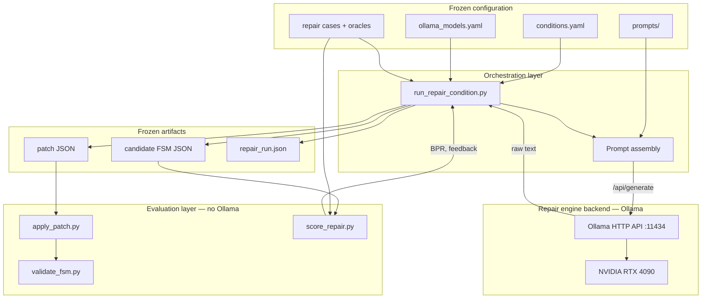

# Local model execution architecture

This document specifies how the study **repair engine backend** runs on a local workstation using [Ollama](https://ollama.com/). The backend **proposes** candidate edits (patches or full FSM JSON); a separate **evaluation layer** scores behaviour deterministically. The architecture is designed for reproducible campaigns at scale on NVIDIA RTX 4090-class hardware, with optional **multiple local engines** for sensitivity analysis only—not for model leaderboards.

Canonical configuration: [`environment/ollama_models.yaml`](../environment/ollama_models.yaml). HTTP client: [`scripts/ollama_client.py`](../scripts/ollama_client.py). Condition driver (partial): [`scripts/run_repair_condition.py`](../scripts/run_repair_condition.py).

## Design goals

| Goal | Mechanism |
|------|-----------|
| **Reproducible runs** | Frozen prompts, configs, and deposited outputs; manifest with versions and checksums |
| **Determinism where possible** | Low temperature, fixed decoding caps, logged seeds/options; stochastic residual documented |
| **RTX 4090 utilisation** | Single-GPU Ollama instance; documented VRAM and concurrency limits |
| **Multiple local engines** | Primary + sensitivity tags in config; one engine per run record |
| **Separation of concerns** | Generation (Ollama) ≠ patch application ≠ oracle evaluation |

## Architecture diagram



**Data flow (one repair iteration):**

1. Orchestration loads case, condition, and engine settings.
2. Prompt assembly builds a **frozen template** + bindings (feedback from last evaluation).
3. Ollama returns a text artefact (patch or FSM JSON) — **non-deterministic** component.
4. Evaluation parses/applies patches, validates structure, runs oracles → **deterministic** BPR and feedback.
5. Orchestration records metrics in `repair_run` / case history; loop or terminate.

No oracle or patch script calls Ollama.

## Layer responsibilities

### Repair engine backend (Ollama)

- **Inputs:** Rendered prompt, `model_name`, decoding options from `ollama_models.yaml`.
- **Outputs:** Raw generation string (expected: JSON patch or FSM document).
- **Not responsible for:** Declaring repair success, computing BPR, or applying edits.

### Evaluation layer (local Python)

| Component | Role |
|-----------|------|
| `apply_patch.py` | Deterministic patch application (v1: transition ops) |
| `validate_fsm.py` | Schema + referential integrity |
| `score_repair.py` | Oracle execution and BPR |
| Future parser | Extract JSON from engine output; reject malformed artefacts |

### Orchestration layer

- Selects **repair condition** (primary IV), not engine ranking.
- Enforces attempt budget, routes feedback by condition (see [`experimental_conditions.md`](experimental_conditions.md)).
- Writes **run logs** and updates frozen records.

## Workstation and RTX 4090

### Hardware assumptions

- One study workstation with an **NVIDIA RTX 4090** (24 GB VRAM typical).
- Models pulled locally via Ollama; no cloud inference in the study protocol.

### Ollama and GPU

- Run Ollama as a **local daemon** (`http://127.0.0.1:11434` by default).
- Ensure GPU visibility, e.g. `nvidia-smi` shows the 4090 before campaigns.
- Prefer **one concurrent generation** per GPU during formal runs to avoid VRAM contention and latency variance; queue cases sequentially or use an explicit job scheduler documented in the run manifest.
- Record in `results/MANIFEST.md` at freeze:
  - GPU driver version
  - CUDA / toolkit version (if applicable)
  - Ollama version (`ollama --version`)
  - `OLLAMA_*` environment variables that affect runtime (see below)

### Environment variables (document, do not commit secrets)

| Variable | Purpose |
|----------|---------|
| `CUDA_VISIBLE_DEVICES` | Restrict to the 4090 used for the study |
| `OLLAMA_HOST` | Bind address (default `127.0.0.1:11434`) |
| `OLLAMA_NUM_PARALLEL` | Keep low (e.g. `1`) for reproducible timing and VRAM |
| `OLLAMA_MAX_LOADED_MODELS` | Limit resident weights if switching engines between batches |

Exact values are **frozen in the manifest**, not hard-coded in the public repo.

## Multiple local engines (not a benchmark)

| Role | Config key | Use |
|------|------------|-----|
| **Primary engine** | `primary_model` | Main condition-effect analysis |
| **Sensitivity engines** | `sensitivity_models[]` | Repeat **subset** of conditions to test stability of condition ordering |

Rules:

- Same cases, oracles, prompts, and budgets when comparing engines.
- Report engine-stratified results in **supplementary** material only.
- Do **not** frame engine differences as the paper contribution.
- Each run records `model_name` in [`repair_run`](../schemas/repair_run.schema.json) (see [`repair_run_format.md`](repair_run_format.md)).

## Execution workflow

### Phase 0 — Preflight

1. Verify Ollama health: `GET /api/tags` (or `scripts/ollama_client.health_check`).
2. Confirm required model tags are present locally (`ollama list`).
3. Load `environment/ollama_models.yaml` and `environment/conditions.yaml`.
4. Record preflight metadata in the campaign log (versions, GPU, config hashes).

### Phase 1 — Campaign matrix

For each **eligible repair case** × **repair condition** × **engine** (primary always; sensitivity per pre-registration):

| Step | Action | Layer |
|------|--------|-------|
| 1 | Load `case.json` + candidate FSM | Orchestration |
| 2 | If condition A: score only → write `repair_run` | Evaluation |
| 3 | If condition B/C/D/E: assemble prompt | Orchestration |
| 4 | Call Ollama `/api/generate` | Backend |
| 5 | Parse output → patch or FSM path | Orchestration |
| 6 | `apply_patch` / validate | Evaluation |
| 7 | `score_repair` → BPR, feedback | Evaluation |
| 8 | Check budget, regression, convergence | Orchestration |
| 9 | Repeat 3–8 until success or stop | Both |
| 10 | Write `repair_run.json` + freeze artefacts | Artifacts |

Use `--dry-run` on `run_repair_condition.py` to validate prompts without generation.

### Phase 2 — Freeze for Zenodo

1. Copy **final** patches, FSMs, and `repair_run` files into `results/frozen_runs/`.
2. Do **not** deposit raw engine logs unless required for a specific audit claim.
3. Publish `results/MANIFEST.md` with versions, checksums, and decoding options.

### Phase 3 — Audit replication (no Ollama)

Re-score and re-apply patches from frozen files only ([`REPRODUCIBILITY.md`](../REPRODUCIBILITY.md) Mode A).

## Deterministic settings when possible

| Setting | Recommendation | Notes |
|---------|----------------|-------|
| `temperature` | `0.0` or `0.1–0.2` (pre-registered) | Lower reduces variance; document actual value |
| `top_p`, `top_k` | Fixed in `ollama_models.yaml` | Omit from ad-hoc changes mid-campaign |
| `num_predict` | Cap high enough for JSON patch | Prevents truncation artefacts |
| `seed` | Set when supported by Ollama/model | Log in run provenance; same seed does not guarantee bitwise replay across driver updates |
| Prompt bytes | Frozen files under `prompts/` | Hash in manifest |
| Evaluation | Always deterministic | Same FSM + oracle → same BPR |

**Residual stochasticity:** Even with low temperature, treat engine output as a random proposal; scientific claims rely on **frozen outputs** and **deterministic re-evaluation**.

## Logging requirements

Logs support debugging and replication; **raw logs stay outside the public artifact** unless a paper claim requires them ([`DATA_STATEMENT.md`](../DATA_STATEMENT.md)).

### Per-generation log entry (minimum)

```json
{
  "run_id": "tlc_01__patch_trace_feedback__engine_a",
  "input_case_id": "tlc_01",
  "repair_condition": "patch_trace_feedback",
  "model_name": "<engine-tag>",
  "iteration": 1,
  "timestamp_utc": "2026-06-03T14:02:10Z",
  "prompt_sha256": "<hex>",
  "request_options": { "temperature": 0.2, "num_predict": 4096 },
  "response_sha256": "<hex>",
  "response_length_chars": 842,
  "parse_status": "ok",
  "latency_ms": 3200
}
```

### Per-run summary log

Align fields with [`repair_run_format.md`](repair_run_format.md): `input_bpr`, `output_bpr`, `patch_count`, `patch_size`, `regression_detected`, `convergence_status`.

### Campaign log (once per batch)

- `ollama` version, GPU driver, `primary_model`, `sensitivity_models`
- Git commit hash of artifact repo
- `conditions.yaml` / `ollama_models.yaml` SHA-256
- Start/end timestamps, case count, failure counts by type (`parse_error`, `patch_rejected`, `budget_exhausted`)

### Log storage (private workspace)

Store under a dated directory outside Zenodo, e.g. `campaigns/2026-06-03/`. Export only derived `repair_run` JSON and frozen patches to `fsm-repairability-study/results/`.

## Reproducibility recommendations

1. **Freeze before analysis** — No prompt or `ollama_models.yaml` edits after tagging a release.
2. **One manifest** — `results/MANIFEST.md` lists every `run_id`, file path, SHA-256, and engine tag.
3. **Separate engine from evaluation** — Never compute BPR inside Ollama prompts as authoritative; always use `score_repair.py`.
4. **Serialize campaigns** — Avoid parallel Ollama calls on one GPU during primary data collection.
5. **Record failures** — Log parse errors and patch application rejections; do not silently drop iterations.
6. **Primary vs sensitivity** — Pre-register which conditions are re-run on sensitivity engines.
7. **Audit path** — Verify published condition contrasts using frozen runs without invoking Ollama.
8. **No mid-study option tuning** — Decoding changes confound condition comparisons; treat as a new campaign.

## Interface contract (backend ↔ orchestration)

| Direction | Payload |
|-----------|---------|
| Orchestration → Ollama | `model`, `prompt`, `options`, `stream: false` |
| Ollama → Orchestration | `response` text (JSON patch or FSM) |
| Orchestration → Evaluation | FSM path, patch path, oracle suite id |
| Evaluation → Orchestration | BPR, pass/fail per check, feedback fields for next prompt |

Malformed engine output must **not** advance the iteration counter as a successful repair step; log `parse_status: failed` and apply protocol for abort or retry.

## Planned extensions (out of scope for v1)

- Batch driver script with job queue and resume checkpoints
- Structured JSON mode enforcement in parser
- Automatic `inverse_operations` attachment on accepted patches
- Hardware monitoring hooks (VRAM peak per generation)

## See also

- [`experimental_setup.md`](experimental_setup.md) — replication modes
- [`experimental_conditions.md`](experimental_conditions.md) — what each condition feeds the engine
- [`REPRODUCIBILITY.md`](../REPRODUCIBILITY.md) — public artifact workflow
- [`environment/README.md`](../environment/README.md) — setup commands
