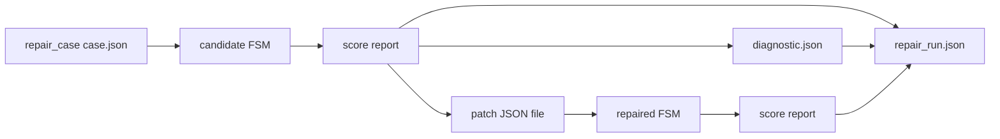

# Repair condition runner (dry-run)

Deterministic orchestration of **one repair case × one repair condition** without calling Ollama or any external generative model. Implemented by [`scripts/run_repair_condition.py`](../scripts/run_repair_condition.py).

The runner is tested under Python 3.12+ and is not intended to support Python 3.6.

## Purpose

The dry-run runner validates the **experimental loop shape** end to end using only local, reproducible scripts:

```text
FSM → score → diagnostic → patch (file) → apply patch → score → repair_run record
```

It wires together artefacts already defined in this repository:

| Stage | Script / schema |
|-------|-----------------|
| Score | [`score_repair.py`](../scripts/score_repair.py) |
| Diagnostic | [`build_diagnostic.py`](../scripts/build_diagnostic.py) → [`diagnostic.schema.json`](../schemas/diagnostic.schema.json) |
| Patch | [`apply_patch.py`](../scripts/apply_patch.py) ← [`patch.schema.json`](../schemas/patch.schema.json) |
| Run record | [`repair_run.schema.json`](../schemas/repair_run.schema.json) v2.0.0 |
| Case inputs | [`repair_case.schema.json`](../schemas/repair_case.schema.json) v2.0.0 (`case.json` in `--case-dir`) |

## Why it exists before local model integration

1. **Prove orchestration** — Confirm paths, filenames, BPR recomputation, and schema validation before adding nondeterministic engine calls.
2. **Audit replication** — Reproduce improvement from a **checked-in patch file** (`--patch-source`) without GPU or Ollama.
3. **Separate concerns** — Scoring and projection stay deterministic; only patch *authorship* is stubbed via an external JSON file until prompts + Ollama are integrated.

## CLI

```bash
python scripts/run_repair_condition.py \
  --case-dir tests/fixtures/dry_run_case \
  --condition patch_trace_feedback \
  --patch-source tests/fixtures/dry_run_case/repair_patch.json \
  --work-dir /tmp/dry_run_work \
  --output-run /tmp/dry_run_work/repair_run.json
```

| Flag | Role |
|------|------|
| `--case-dir` | Directory containing `case.json`, candidate/reference FSMs, oracle suite |
| `--condition` | `baseline_no_repair`, `patch_binary_feedback`, `patch_trace_feedback`, or `patch_localized_feedback` |
| `--patch-source` | Patch JSON (required for patch conditions; forbidden for baseline A) |
| `--work-dir` | Writable tree for candidates, scores, diagnostics, patches |
| `--output-run` | Destination `repair_run.json` |

### Baseline A (`baseline_no_repair`)

- No `--patch-source`.
- Copies initial candidate, scores on feedback + validation oracles, writes `repair_run` with `max_iterations = 0`, `execution_backend = "none"`, empty `iterations`.

### Patch conditions C–E

- Projects diagnostic at the level matching the condition (`binary` / `trace` / `localized`).
- Copies `--patch-source` to `patches/iter_000_source.json`, applies it, re-scores, records one iteration.

## Work directory layout (deterministic)

```text
work-dir/
  case.json                 # snapshot copied from --case-dir (read-only source unchanged)
  candidates/
    initial.json
    iter_001.json           # after patch (patch conditions only)
  scores/
    iter_000_input_feedback.json
    iter_000_input_validation.json
    iter_001_feedback.json
    iter_001_validation.json
  diagnostics/
    iter_000_feedback.json
  patches/
    iter_000_source.json
```

## Relation to artefacts



- **repair_case** — Loaded from `--case-dir`; never modified.
- **diagnostic** — Built from the *feedback* score report at the condition’s projection level.
- **patch** — Supplied externally in dry-run (later: model output parsed to the same schema).
- **repair_run** — Emitted to `--output-run`; validated against v2.0.0 schema.

## Later: Ollama-generated patches

The dry-run runner will be **extended**, not replaced:

| Dry-run (now) | With local model (planned) |
|---------------|----------------------------|
| `--patch-source` file | Render prompt from [`prompts/`](../prompts/), call Ollama, parse JSON patch |
| `execution_backend: "none"` | `execution_backend: "ollama"` + `model_name` / digest |
| `prompt_tokens_estimated: 0` | Record engine token estimates |

Scoring, diagnostic projection, patch application, and `repair_run` assembly remain the same deterministic core.

## Supported conditions

| `condition_id` | Diagnostic level | Patch in dry-run |
|----------------|------------------|------------------|
| `baseline_no_repair` | — | No |
| `patch_binary_feedback` | `binary` | External file |
| `patch_trace_feedback` | `trace` | External file |
| `patch_localized_feedback` | `localized` | External file |

`baseline_full_regeneration` is out of scope for this orchestrator (full FSM regen, not patch loop).

## See also

- [`repair_prompt_protocol.md`](repair_prompt_protocol.md)
- [`diagnostic_generation.md`](diagnostic_generation.md)
- [`experimental_conditions.md`](experimental_conditions.md)
- [`scripts/README.md`](../scripts/README.md)
