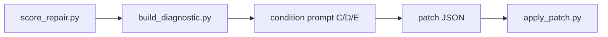

# Repair prompt protocol

Controlled prompt templates for patch repair conditions **C**, **D**, and **E** in the behavioural repairability study. Templates live under [`prompts/`](../prompts/); diagnostics are projected by [`build_diagnostic.py`](../scripts/build_diagnostic.py) per level ([`diagnostic_generation.md`](diagnostic_generation.md)).

## Why prompts are condition-specific

The **primary independent variable** is repair condition (`condition_id`). Conditions C–E differ only in **how much oracle evidence** the repair engine may see after each scoring step. If every condition shared one prompt, the study could not separate:

- repair under **pass/fail identifiers** (C),
- repair under **execution witnesses** (D),
- repair under **witnesses plus structural localization** (E).

Each template therefore states an explicit **allowed diagnostic information** section matched to the projected diagnostic level (`binary`, `trace`, `localized`). The runner binds the same four placeholders in all conditions; only the diagnostic JSON content changes via [`build_diagnostic.py`](../scripts/build_diagnostic.py).

| Condition | `condition_id` | Prompt file | Diagnostic level |
|-----------|----------------|-------------|------------------|
| C | `patch_binary_feedback` | [`repair_binary_feedback.md`](../prompts/repair_binary_feedback.md) | `binary` |
| D | `patch_trace_feedback` | [`repair_trace_feedback.md`](../prompts/repair_trace_feedback.md) | `trace` |
| E | `patch_localized_feedback` | [`repair_localized_feedback.md`](../prompts/repair_localized_feedback.md) | `localized` |

## Avoiding diagnostic leakage

**Leakage** occurs when a condition receives evidence reserved for another condition (e.g. traces in C, or localization in D). Mitigations:

1. **Deterministic projection** — `build_diagnostic.py` strips fields not allowed at the selected level before the prompt is filled.
2. **Prompt wording** — each template lists allowed and forbidden evidence; the repair engine must not assume withheld fields.
3. **Frozen diagnostics on the run** — prompts receive `{{diagnostic_json}}` from the archived feedback file, not from a live validation suite or full score report.

Validation-oracle results remain on the repair run record for confirmatory BPR; they are **not** injected into these prompts.

## Why patches are preferred to regeneration

The study measures **incremental repairability** under oracle feedback, not open-ended re-synthesis. Patch documents ([`patch_language.md`](patch_language.md), [`schemas/patch.schema.json`](../schemas/patch.schema.json)) provide:

- auditable, typed edits;
- deterministic application ([`apply_patch.py`](../scripts/apply_patch.py));
- comparable **patch cost** across conditions.

**Full FSM regeneration** is isolated in baseline B ([`baseline_full_regeneration.md`](../prompts/baseline_full_regeneration.md)). Conditions C–E prompts **forbid** full regeneration so observed effects attribute to feedback level, not to a different repair modality.

## Placeholder bindings

All three repair templates use the same binding contract (assembled by the repair runner, not by the prompts themselves):

| Placeholder | Source |
|-------------|--------|
| `{{requirement_text}}` | Repair case `inputs.requirement_text` |
| `{{candidate_fsm_json}}` | Current candidate FSM JSON (formatted) |
| `{{diagnostic_json}}` | Projected diagnostic for this iteration and condition level |
| `{{patch_schema_json}}` | Frozen [`schemas/patch.schema.json`](../schemas/patch.schema.json) text |

No model name, temperature, or engine identifier appears in prompt files.

## Output and abstention

Templates require **JSON-only** output: one patch object conforming to the patch schema. No markdown wrappers.

If no safe repair is justified, the template instructs an **abstention** patch:

```json
{
  "operations": [],
  "metadata": { "rationale": "...", "abstain": true }
}
```

The runner records abstentions; schema validation of non-empty patches applies only when operations are proposed.

## Fit with experimental conditions



- **C** — binary diagnostic → [`repair_binary_feedback.md`](../prompts/repair_binary_feedback.md)
- **D** — trace diagnostic → [`repair_trace_feedback.md`](../prompts/repair_trace_feedback.md)
- **E** — localized diagnostic → [`repair_localized_feedback.md`](../prompts/repair_localized_feedback.md)

Condition A has no prompt; condition B uses the regeneration baseline only.

## Frozen for Zenodo

At artifact release, the following are **version-locked** together:

| Artefact | Path |
|----------|------|
| Prompt templates C–E | `prompts/repair_*_feedback.md` |
| This protocol | `docs/repair_prompt_protocol.md` |
| Patch schema | `schemas/patch.schema.json` |
| Diagnostic schema | `schemas/diagnostic.schema.json` |
| Condition registry | `environment/conditions.yaml` |
| Projected diagnostics in frozen runs | `results/frozen_runs/.../feedback/` |

Post-freeze edits to prompt wording break comparability with deposited runs and must be avoided.

## See also

- [`experimental_conditions.md`](experimental_conditions.md)
- [`diagnostic_model.md`](diagnostic_model.md)
- [`prompts/README.md`](../prompts/README.md)
